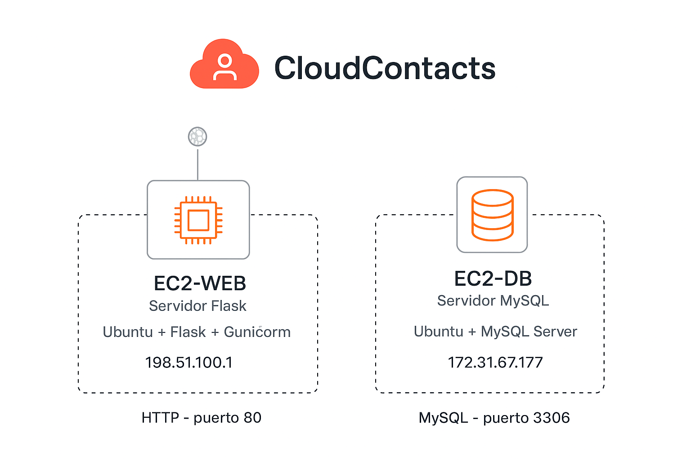

# ☁️ CloudContacts – Agenda de Contactos en la Nube

## 📘 Descripción del Proyecto
**CloudContacts** es una aplicación web desarrollada con **Python (Flask)** y **MySQL**, desplegada en **AWS** con una arquitectura de **dos instancias EC2**.  
Su objetivo es gestionar contactos en la nube de forma segura y escalable, siguiendo las mejores prácticas de desarrollo y despliegue en entornos cloud.

---

## 🎯 Objetivo
Diseñar, construir y desplegar una aplicación que permita:
- Registrar contactos (nombre, correo y teléfono opcional)
- Listar los contactos registrados con fecha y hora
- Conectarse a una base de datos MySQL en un servidor EC2 aislado
- Implementar un entorno de producción seguro con **Gunicorn** y **Systemd**

---

## 🧩 Arquitectura de la Solución

**Diagrama lógico:**

[Internet] 🌐
│ (HTTP - puerto 80)
▼
┌─────────────────────────────┐
│ EC2-WEB (Servidor Flask) │
│ Ubuntu + Flask + Gunicorn │
│ IP Pública: 98.92.254.100 │
└───────────────┬─────────────┘
│ (MySQL - puerto 3306)
▼
┌─────────────────────────────┐
│ EC2-DB (Servidor MySQL) │
│ Ubuntu + MySQL Server │
│ IP Privada: 172.31.67.177 │
│ Solo accesible desde EC2-WEB │
└─────────────────────────────┘


**Diagrama visual (AWS):**


---

## 🔒 Configuración de Grupos de Seguridad

### EC2-WEB (Servidor Flask)
| Tipo | Protocolo | Puerto | Origen |
|------|------------|--------|--------|
| HTTP | TCP | 80 | 0.0.0.0/0 |
| SSH | TCP | 22 | Tu IP pública (solo para administración) |

### EC2-DB (Servidor MySQL)
| Tipo | Protocolo | Puerto | Origen |
|------|------------|--------|--------|
| MySQL/Aurora | TCP | 3306 | Grupo de seguridad de EC2-WEB |

🔐 Esto garantiza que solo EC2-WEB puede comunicarse con la base de datos.

---

## 🗃️ Instalación y Configuración de MySQL (EC2-DB)

```bash
sudo apt update && sudo apt install mysql-server -y
sudo systemctl start mysql && sudo systemctl enable mysql
sudo mysql

Dentro de MySQL:

CREATE DATABASE cloudcontacts;
CREATE USER 'clouduser'@'172.31.77.1' IDENTIFIED BY 'TuContraseñaSegura';
GRANT ALL PRIVILEGES ON cloudcontacts.* TO 'clouduser'@'172.31.77.1';
FLUSH PRIVILEGES;


Editar /etc/mysql/mysql.conf.d/mysqld.cnf:

bind-address = 0.0.0.0


Luego:

sudo systemctl restart mysql

💻 Instalación y Despliegue en EC2-WEB
1️⃣ Instalar dependencias
sudo apt update && sudo apt install python3 python3-venv python3-pip nginx -y

2️⃣ Clonar el repositorio
git clone https://github.com/anafelix21/cloudcontacts-ana.git
cd cloudcontacts-ana

3️⃣ Crear entorno virtual e instalar paquetes
python3 -m venv venv
source venv/bin/activate
pip install -r requirements.txt

4️⃣ Crear archivo .env
nano .env


Agrega:

DB_HOST=172.31.67.177
DB_USER=clouduser
DB_PASSWORD=TuContraseñaSegura
DB_NAME=cloudcontacts

🚀 Despliegue de Producción (Gunicorn + Systemd)
Crear el servicio:
sudo nano /etc/systemd/system/cloudcontacts.service


Pega:

[Unit]
Description=Gunicorn instance for CloudContacts
After=network.target

[Service]
User=ubuntu
Group=www-data
WorkingDirectory=/home/ubuntu/cloudcontacts-ana
Environment="PATH=/home/ubuntu/cloudcontacts-ana/venv/bin"
ExecStart=/home/ubuntu/cloudcontacts-ana/venv/bin/gunicorn -w 3 -b 0.0.0.0:80 app:app

[Install]
WantedBy=multi-user.target


Activa y arranca el servicio:

sudo systemctl daemon-reload
sudo systemctl enable cloudcontacts
sudo systemctl start cloudcontacts
sudo systemctl status cloudcontacts


✅ Tu app quedará activa en:
👉 http://98.92.254.100:5000

📜 Comandos útiles
Acción	Comando
Ver estado del servicio	sudo systemctl status cloudcontacts
Reiniciar app	sudo systemctl restart cloudcontacts
Ver logs	sudo journalctl -u cloudcontacts -f
📦 Repositorio y Acceso Público

📁 Repositorio GitHub:
👉 https://github.com/anafelix21/cloudcontacts-ana

🌐 Aplicación en ejecución (IP Elástica):
👉 http://98.92.254.100

✨ Créditos

Autor: Ana Cristina
Proyecto: CloudContacts – Agenda de Contactos en la Nube
Institución: Instituto Valle Grande
Fecha: Noviembre 2025


